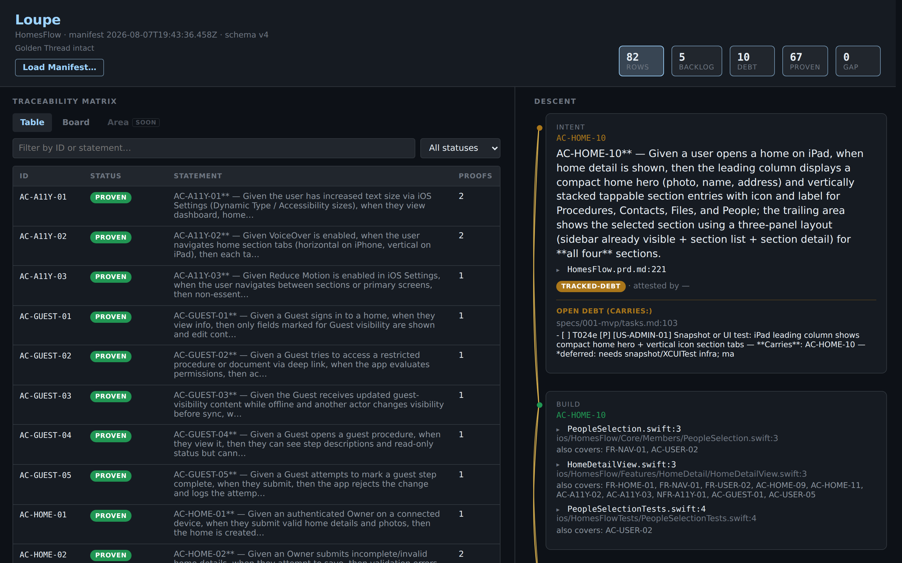
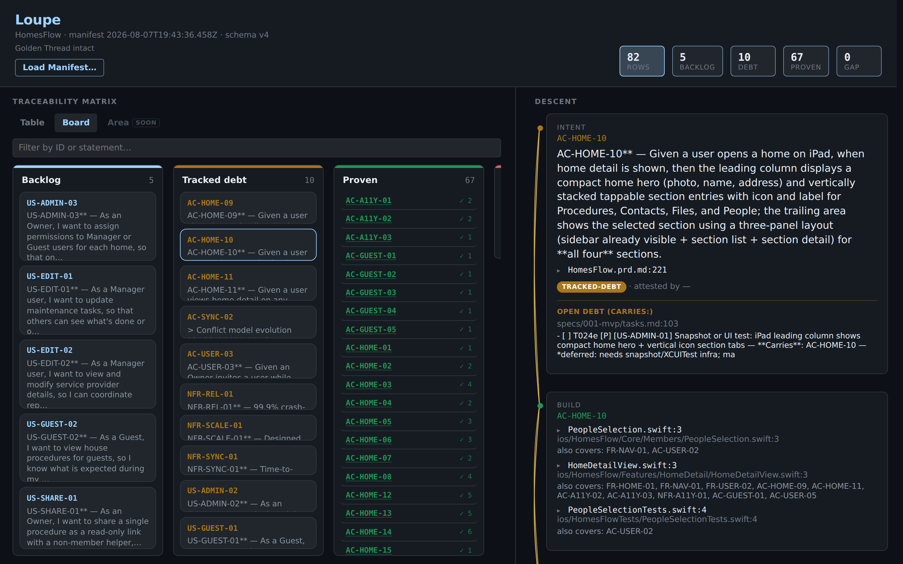
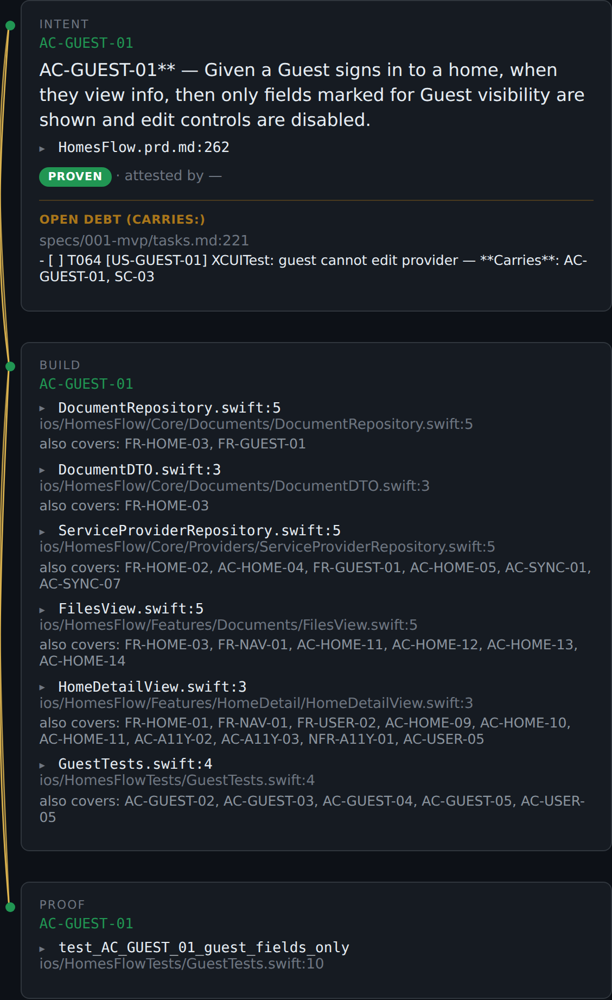
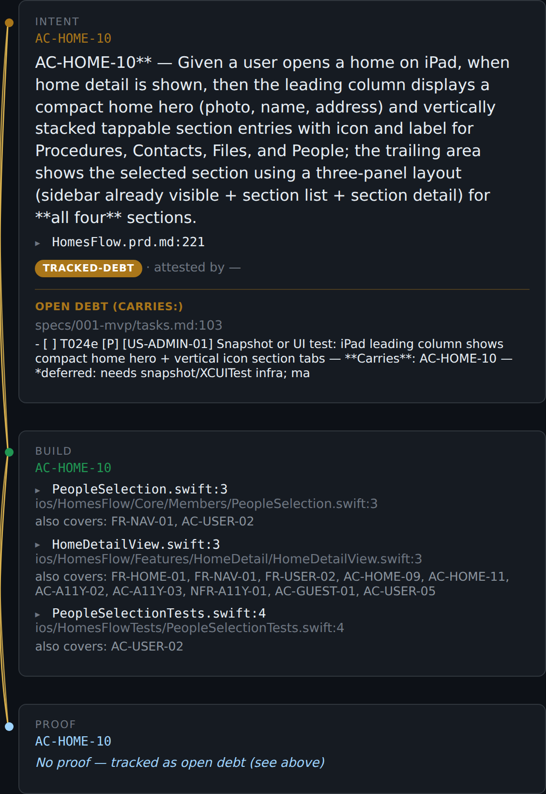
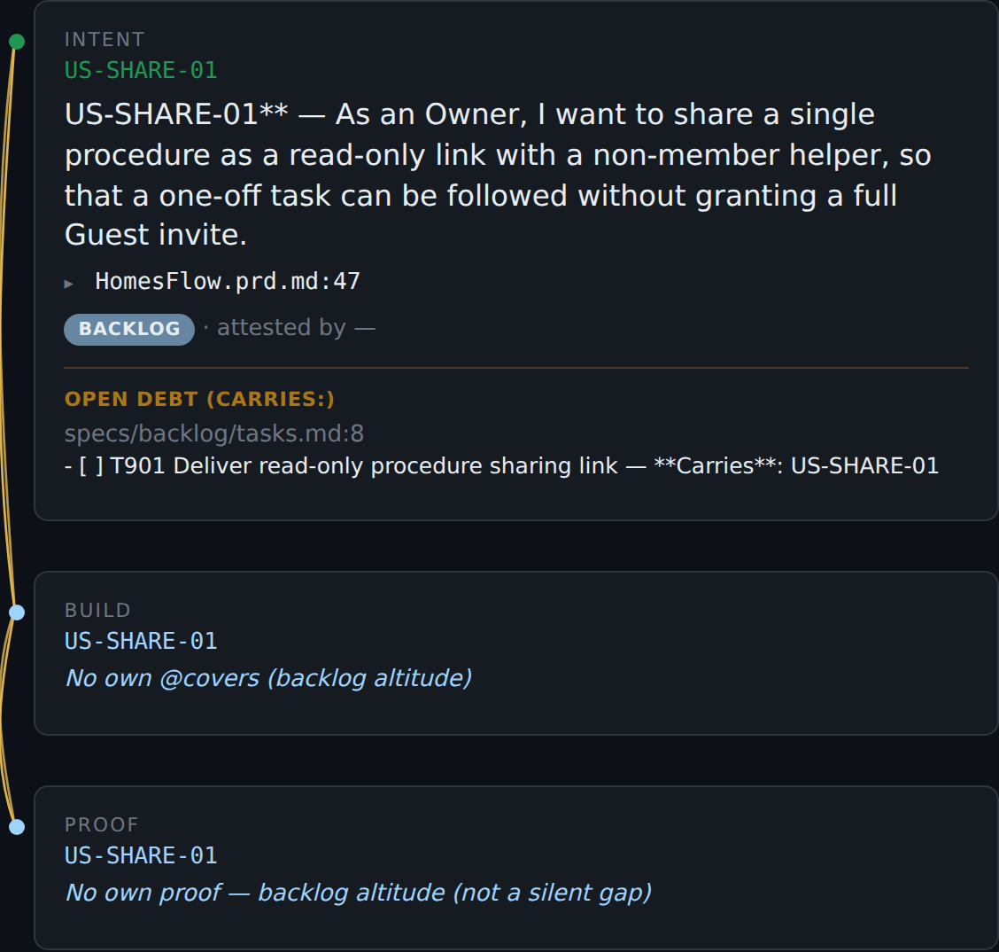
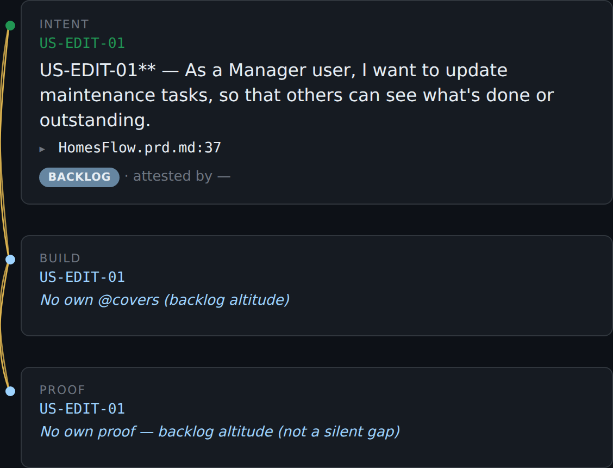
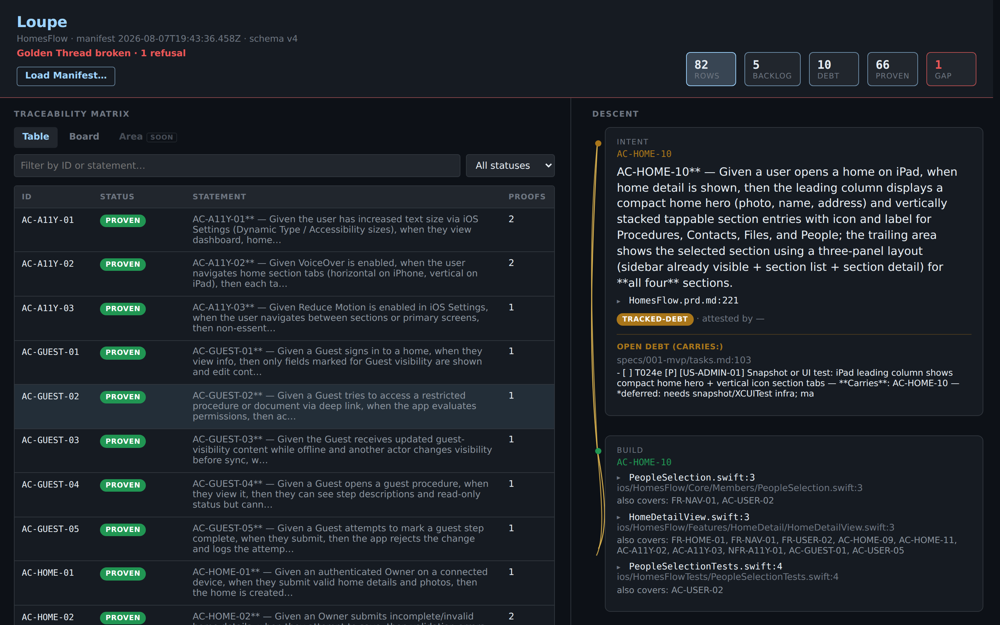
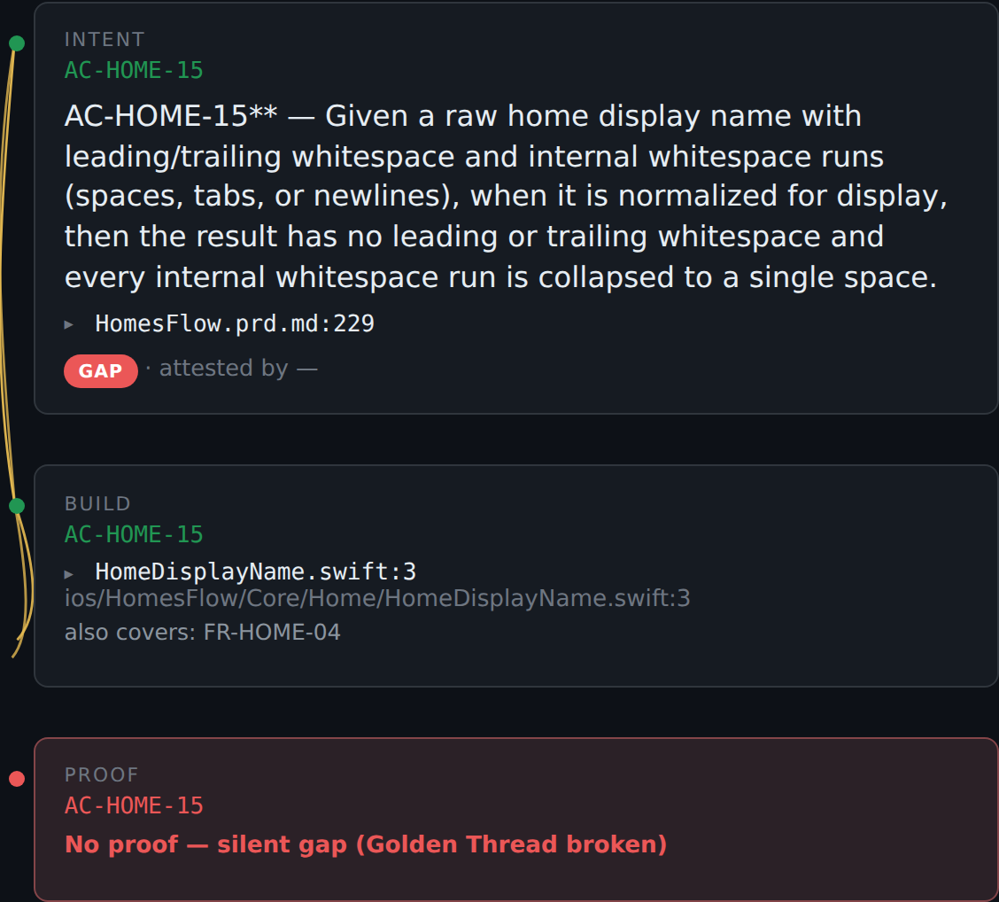
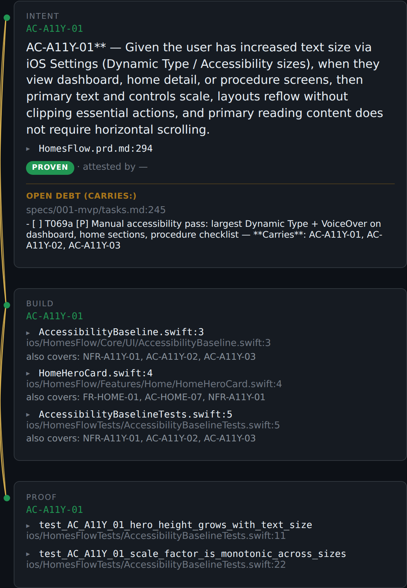

# Follow the thread

The SpecAssay field guide: a tour of **SpecAssay**, the **trace-manifest**, and **Loupe**, one screenshot at a time. The captures are a live render of HomesFlow's real Gate 2 emit (`samples/homesflow.trace-manifest.json`); the three broken shots (section 6) came from a deliberate, real break in a scratch copy.

## Why bother

Everyone can ship plausible code now. The hard part is proving it does what you meant: which intent it served, what build filled that intent, and what proof showed it was done. When that answer takes longer than a coffee, the Golden Thread is already lost. Old ALM stacks tried to hold the map in a second system that always lagged the repo. This stack keeps the map *in* the repo and checks it on every Gate run. That check belongs in **CI**, not only on the nice developer's laptop: a cowboy without SpecAssay installed can still push, and the CI Gate is the property line.

Pull any feature and show its intent → build → proof chain before the coffee cools. That is the whole pitch. Loupe is the glass. SpecAssay is the assay office. The trace-manifest is the hallmarked record you keep.

- **SpecAssay**: a small overlay on stock Spec Kit. Every intent gets a durable ID; the build marks which one it serves; acceptance criteria need proof. Silent gaps stop the line. Then the Gate strikes what it found into a file.
- **trace-manifest**: that file (default `trace-manifest.json`). Living documentation wound from the repo, not typed into a lagging side tool. The `format` value belongs to no single tool, so any emitter can write one and Loupe can read it.
- **Loupe**: the magnifying glass. Does not re-scan. Only reads the trace-manifest. Follow the Golden Thread; spot the fray.

Spec Kit stays Spec Kit. No second career in ALM. The interface is already a little fun; the docs should not scare you out of trying it.

For the workflow story see [`reading-a-manifest.md`](./reading-a-manifest.md); for terms see [`../presets/specassay/GLOSSARY.md`](../presets/specassay/GLOSSARY.md).

### Don't panic about the IDs

Eighty-two durable IDs in the sample can look like a lot. Most of them live in the PRD and the specs, the ordinary places intents already get written down. You do **not** paste an ID onto every line of code. The ID prefixes are the ordinary requirement types wearing name tags: `US-` user story, `FR-` functional requirement, `NFR-` non-functional, `AC-` acceptance criterion. If you've written requirements, you already know these; "intent" is just the word for what they all are before the build serves them.

**Leave a mark when you touch the work.** If the code serves a named intent, one short comment: `@covers …`. If a task is still open against an intent, name it on the task: `Carries:`. Those marks are greppable; SpecAssay watches them; you do not memorize the grid.

What you are looking at in the loupe is **living documentation**: the record is wound from the repo itself (names, comments, tasks, tests). When the work drifts, the Golden Thread shows it. That is the point.

## Where these pictures came from

The Thread-intact captures are a real render of HomesFlow's live Gate 2 emit, the same emit shipped as [`../samples/homesflow.trace-manifest.json`](../samples/homesflow.trace-manifest.json). No hand-edited JSON. HomesFlow is a small real app used as public evidence of the practice; the count of IDs is "a product with a PRD," not "a compliance mountain."

The three Thread-broken captures (section 6) came from a deliberate break in a scratch copy of the trial tree: one test was renamed so its acceptance criterion lost its named proof while no open task claimed it. The Gate was re-run for real, refused for real, and the scratch copy was deleted afterward. The refusal is honest; only the break was staged.

## 1. The top bar: is the Golden Thread intact?

Before reading any row, the top bar answers the only global question:

- **Golden Thread intact.** The trace-manifest contains zero hidden unfinished work. Not zero unfinished work; zero *hidden* unfinished work.
- The stat tiles read left to right: **Rows** (all durable IDs), then **Backlog → Debt → Proven** (waiting, excused, proven), with **GAP** last. Each tile is a filter button.
- The `GAP` tile only lights up red when GAPs exist. Here it reads 0, which is why the Golden Thread is intact.
- **Read Manifest…** loads any other `*.trace-manifest.json` file. The loupe never re-scans a repo; it only reads what the Gate emitted.

## 2. Board lens: the four buckets

Same rows, partitioned by status in the same order:

- **Backlog**: minted and waiting. Planning-altitude stories and features without their own carrier, plus anything anointed into backlog (section 4). Not a defect.
- **Tracked debt**: not done, and the team said so on an open task. Honest yellow.
- **Proven**: proof exists. Each card counts its proofs.
- **GAP**: last and usually empty, and the column says why. When this column has cards, the Golden Thread is broken.

## 3. The Descent: one thread, three tiers

Click any row and the right pane walks the Golden Thread top to bottom:

- **Intent**: the durable ID and its statement, plus a **▸ file:line** toggle (e.g. `HomesFlow.prd.md:258`) that expands to the actual PRD/registry source around the line where the ID was minted.
- **Build**: every `@covers` mark found in source, each labeled with the file basename and line (e.g. `HomeDetailView.swift:3`), the full path below, and an "also covers: …" line naming the other IDs that share the same annotation. Each expands to the real code around it.
- **Proof**: named tests that encode the ID (for ACs), labeled by test name with the path below, expandable the same way.

**`@covers` in one breath.** A one-line mark, `// @covers AC-GUEST-01, FR-HOME-03`, naming which intents this code serves. Leave it when you touch the file. The Gate reads it; SpecAssay never invents one for you. Loupe lists those hits under Build. The task-side twin is `**Carries**:` on an open checkbox. Missing or made-up IDs fail closed, so the habit stays light: mark what you meant, and the check keeps you honest.

Every claim in the descent can be opened to the file and line that backs it, intent included. The braided line down the left side is the Golden Thread itself. Its two states matter more than any color: **solid** means the Thread holds; **frayed** means it is broken.

### A proven AC, proof and all

`AC-GUEST-01` end to end: the intent statement with its registry line (`HomesFlow.prd.md:258`), six `@covers` marks each labeled by file and line, and a named proof `test_AC_GUEST_01_guest_fields_only`. Green nodes, solid braid. This is what "proven" means: a named artifact you can open, not "the tests passed once."

Note this proven row also carries an **Open debt (Carries:)** block, an XCUITest still open on `T064`. Proven with additional open work is a normal, honest state.

### Tracked debt: amber, but nothing is hidden

`AC-HOME-10` is not done, and nobody is pretending otherwise.

- The top of the Thread is **amber**: the intent is real and owed.
- Right under it, an open task admits the gap (`T024e`: still needs a snapshot/UI test). That admission is what makes this debt instead of a lie.
- The middle is green: code already claims this ID. The bottom is **blue**: no named proof yet, but honestly so. The braid between them stays solid.

Amber or blue without fray means *incomplete but excused* — amber for owed debt, blue for not-yet. Someone wrote it down, so the Golden Thread stays intact.

## 4. Anointed backlog: minted on purpose, carried by a TODO

Minting an ID is a promise, and that is a feature, not a trap. Name an intent only when you mean it; if nothing claims it yet, write one open TODO that carries it (**anointed backlog**, usually in `specs/backlog/tasks.md`). That is enough ceremony that fat-finger drift still fails, while an honest "build this soon" stays clean.

Here `US-SHARE-01` shows exactly that state: a minted-ahead Owner story (a read-only procedure-share link), status **BACKLOG**, the registry line it was minted on, and the open TODO `T901` that carries it. Zero spec, zero code, zero proofs, Golden Thread intact. Drop the TODO without picking up the work and the next check fails exact-set. The Thread will not carry an unclaimed promise.

Filter tile `Backlog` reads 5: four planning-altitude stories plus the anointed `US-SHARE-01`.

## 5. Backlog altitude: waiting, not broken

Stories and features (`US-…`, `FR-…`, `NFR-…`) are covered through their child ACs, not by stapling `@covers US-…` onto a file. When they have no carrier of their own, they ride as backlog: **blue** nodes, solid braid, and the Proof tier spells it out: "backlog altitude (not a silent gap)." Silent-gap refusal is AC-only.

## 6. Golden Thread broken: what frays and what does not

The scratch tree after the staged break. Three things change at once:

- The banner goes red: **Golden Thread broken · 1 refusal.**
- The **GAP tile goes hot: 1.** Proven dropped by one; that row moved to GAP.
- Rows with no proof now fray, because the manifest as a whole can no longer vouch for them.

That hot GAP tile is the assay office's whole reason for being. A silent gap is **gilt**: work gilded to gleam like solid gold, with no proof underneath. The assay strips the gilding; the thread frays. (It carries the other reading too: the *guilt* of unfinished work nobody admitted.)

### The GAP row itself

`AC-HOME-15`, the broken strand. Build marks still exist, but the named proof is gone and no open task claims the ID. The braid **frays between Build and Proof**, and the Proof tier says why: "No proof — silent gap (thread broken)." This is the one situation the Golden Thread will not carry: unfinished work that nothing durable admits to. (Technically: the Gate refuses.)

### Proven rows stay green even while the Golden Thread is broken

`AC-A11Y-01` during the same broken run: named proofs exist, so its Proof tier stays green and its braid stays solid. A break elsewhere does not un-prove this row's evidence.

## Rules of thumb

| You see                    | It means                                                     |
| -------------------------- | ------------------------------------------------------------ |
| Solid braid, green nodes   | Golden Thread holds; proof exists                            |
| Solid braid, amber node    | Owed — tracked debt, admitted on an open task                |
| Solid braid, blue node     | Not yet — backlog altitude, or an honest-missing step        |
| Open debt (Carries:) block | The exact open task that excuses (or carries) the incompleteness |
| ▸ file:line / ▸ test name  | Expand to the actual source behind the claim                 |
| Frayed braid               | Golden Thread broken: silent gap, or the manifest was refused as a whole |
| Red banner, hot GAP tile   | At least one AC has neither proof nor admitted debt          |

One sentence version: **green is proven, amber is owed debt, blue is not-yet, fray is a broken Golden Thread.**

And the soft landing: you do not have to be scary-good at this. SpecAssay refuses the silent stuff; Loupe shows the rest. Follow the Golden Thread.
